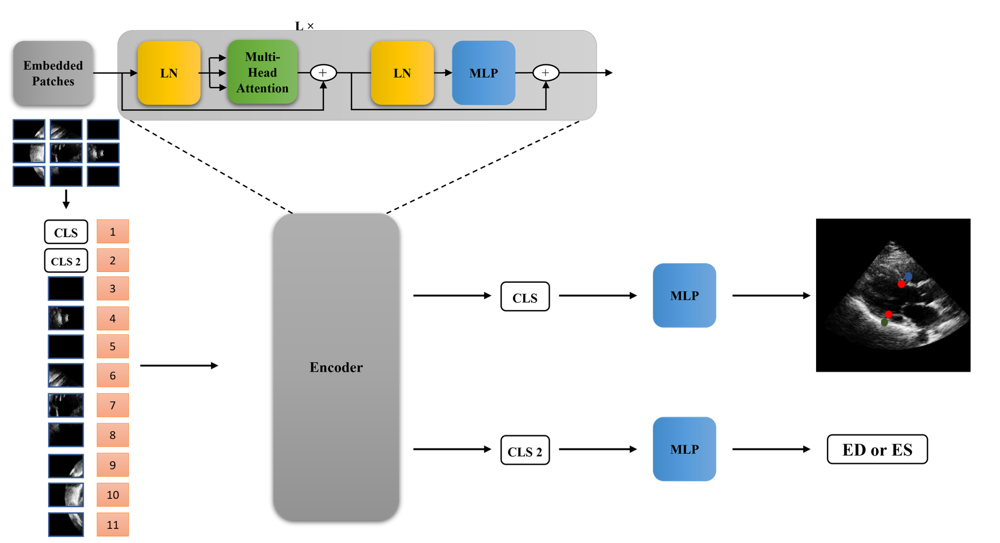

## Project Overview  
This project investigates the use of generative AI models for automatically explaining code snippets. We focus on comparing the performance of different Large Language Models (LLMs) in generating accurate and helpful code explanations.

## Motivation
This project investigates the use of Vision Transformers (VITs) in a multi-tasking biometdical setting. Transformers have demonstrated promising results in various applications, including accurate prediction of heart measurements. One common meaurement obtained from caardio patients is the Left Ventricle Internal Dimension (LVID) which is used in many diagnoses, including heart failure, the leading cause of death in North America.


## Model Architecture


*Figure 1: Overview of the Vision Transformer (ViT) architecture used in this project for multi-task biomedical image analysis, including LVID prediction.*

Our model utilizes a compact Vision Transformer (ViT) architecture, optimized for multi-task biomedical image analysis, including LVID prediction. The ViT processes input images by dividing them into patches, which are then linearly embedded and processed through self-attention layers.

## Repository Structure
- `src/`: Contains the source code for the project
- `config/`: Includes the curated dataset of code snippets
- `scripts/`: Some utility scripts 
- `results/`: Stores the output and evaluation results

## Getting Started
1. Clone the repository
2. Install the required dependencies: `pip install -r requirements.txt`
3. Update the config with the data path and proper model size. 
3. Run the main script:
```sh
python main.py --config_path [path_to_config] --save_dir [path to save dir]
```
or alternatively you can use the `run.sh` file to start training 
